### Ustawienia strony

W poniższym filmiku znajdziesz instrukcję, jak szybko przejść przez Ustawienia strony i na co warto zwrócić uwagę. 

<iframe width="100%" height="550" src="https://player.vimeo.com/video/435808766/?portrait=0&title=0&byline=0" /></iframe>

#### Ustawienia
* **Nazwa strony** - nazwa ta będzie widoczna w lewym górnym rogu (tam, gdzie najczęściej wstawiane jest logo). Jeśli natomiast dodasz logo w poniższej sekcji OBRAZY to wówczas Nazwa strony zostanie zastąpiona logo. 
* **Domena** - adres url, pod jakim będzie dostępna platforma do sprzedaży kursów. Przykład: kursy.nataliablizniuk.pl.
* **Język strony** - wersja językowa, w jakim będzie dostępna platforma dla studentów. Można wybrać wersję polską lub angielską.
* **Waluta** - waluta, w jakiej będą pobierane opłaty za kursy online. Dostępne waluty: PLN, USD, GBP, EUR, CHF. 

#### Funkcje 
* **Włącz funkcję dodawania artykułów** - zaznacz, jeśli chcesz na platformie dodawać artykuły. Nazwa, którą podasz będzie widoczna w górnej nawigacji. Może to być na przykład Blog.

* **Wyświetlaj wiadomość powitalną** - zaznacz, jeśli chcesz wyświetlać wiadomość dla studentów, którzy kupili kurs za pomocą płatności jednorazowych albo po prostu zarejestrowali się do platformy w celu zapoznania się z Twoimi kursami darmowymi (jeśli takie posiadasz) lub płatnymi. Wiadomość będzie widoczna od razu po zalogowaniu do platformy.

* **Wyświetlaj wiadomość powitalną dla subskrybentów** - zaznacz, jeśli chcesz wyświetlać wiadomość dla studentów, którzy dołączyli do Twojej platformy subskrypcyjnej. Wiadomość będzie widoczna od razu po zalogowaniu do platformy. I będzie wyglądała analogicznie do przykładu zamieszczonego powyżej. 
* **Chcę wystawiać faktury manulanie** - zaznacz, jeśli chcesz, aby faktura nie została automatycznie wysłana po zakupie kursu, tylko "na żądanie". Aby ta funkcja zadziała potrzeba jest integracja z systemem do fakturowania.
* **Wyświetlaj pole do wpisania kodu rabatowego na stronie zakupowej** - zaznacz, jeśli chcesz, aby na stronie płatności pojawiło się pole do wpisania kodu promocyjnego dla użytkowników. Pole to pojawi się nad przyciskiem Kup teraz.

* **Chcę użyć zewnętrznych stron sprzedażowych** - zaznacz, jeśli chcesz stworzyć stronę sprzedażową na WordPressie albo w innym narzędziu do landing page. Wówczas platforma będzie wykorzystywana jako panel do nauki.
* **Wyświetlaj dodatkowe linki w nawigacji** - zaznacz, jeśli chcesz dodać dodatkowe linki w górnej nawigacji. Mogą to być linki przekierowujące np. do Twojej domeny głównej. 

 

#### Model pobierania płatności
* **Jednorazowe płatności** - zaznacz, jeśli planujesz sprzedaż kursów online jako jednorazowy zakup.
* **Model subskrypcyjny** - zaznacz, jeśli planujesz uruchomić platformę subskrypcyjną. Systemem płatności, który obsługuje płatności abonamentowe to TPay. 
* **Jednorazowe płatności i Model subskrypcyjny** - zaznacz, jeśli planujesz sprzedaż kursów zarówno w modelu jednorazowym, jak i subskrypcyjnym. 

 

#### Powiadomienia
* **Chcę otrzymywać powiadomienia o ukończonych transakcjach** - zaznacz, jeśli chcesz otrzymywać maile z informacją, że ktoś kupił kurs. Powiadomienie będzie przychodziło na adres e-mail podany przy Rejestracji.
* **Chcę otrzymywać powiadomienia o nowych komentarzach** - zaznacz, jeśli chcesz otrzymywać powiadomienia na temat komentarzy pod Twoimi lekcjami. Aby ta funkcja zadziałała przy lekcjach trzeba włączyć możliwość pozostawiania komentarzy przez studentów. Powiadomienie będzie przychodziło na adres e-mail podany przy Rejestracji.

 

#### Dane autora
* **Nazwa firmy/Imię i nazwisko**
* **E-mail** - adres e-mail będzie dostępny pod nazwą **Kontakt** w nawigacji dolnej.
* **Copyright** - możesz podać nazwę, która będzie widoczna w dolnej nawigacji. Jeśli zostawisz to pole puste to pojawi się Nazwa strony, podana w pierwszym polu. W poniższym przykładzie nazwa wpisana w Copyright to Skyier.
* **Copyright url** - możesz podać link strony, do której ma przekierowywać nazwa podana w Copyright.

 

#### Informacje prawne
* **Regulamin** - miejsce na regulamin platformy do sprzedaży kursów.
* **Polityka prywatności** - miejsce na politykę prywatności platformy do sprzedaży kursów.

 

#### JavaScript
Tutaj wklej kod śledzący. Rekmendowany jest Google Tag Managera. 

 

#### Obrazy
* **Favicon** - ikonka, która pojawi się w polu adresowym przeglądarki internetowej czy na karcie w przeglądarce internetowej. W przypadku braku favicony pojawi się favicona Skyier. 
* **Logo** - logo pojawi się w lewym górnym rogu na stronie głównej platformy oraz w panelu do nauki. 

* **Facebook OG Image** - zdjęcie, które się pojawi w momencie udostępniaania strony głównej platformy na Facebook'u.

 

### Strona główna z kursami online i strona sprzedażowa kursu

<iframe width="100%" height="550" src="https://player.vimeo.com/video/449606606/?portrait=0&title=0&byline=0" /></iframe>

#### Strona główna z kursami

1. Aby stworzyć stronę główną ze swoimi kursami należy przejść do **Ustawień strony -> Edytuj wygląd strony**

2. **A następnie wybierać komponenty, z jakich powinna być zbudowana strona główna.** Przeciągając je na prawą stronę.

 

#### Strona sprzedażowa kursu online

1. Aby stworzyć stronę sprzedażową kursu należy wybrać **Strona sprzedażowa.** 

2. **A następnie wybierać komponenty, z jakich powinna być zbudowana strona sprzedażowa.** Przeciągając je na prawą stronę.

 

### Tworzenie kursu online

#### Dodawanie kursu online

W poniższym filmiku znajdziesz instrukcję, jak szybko dodać swój pierwszy kurs. 

<iframe width="100%" height="550" src="https://player.vimeo.com/video/435808647/?portrait=0&title=0&byline=0" /></iframe>

**1. Po zalogowaniu do platformy wybierz zakładkę KURSY.**

**2. Następnie kliknij w przycisk + Dodaj kurs.**

**3. Wpisz tytuł kursu online. Ten tytuł będzie można później zmienić.** 

**4. Wypełnij OPIS kursu.**
* Tytuł - tytuł kursu, możesz go zmieniać. To pole jest wymagane.
* URL - nazwa, jaka będzie zawarte w adresie URL. Ta nazwa tworzy się automatycznie na podstawie tytułu podanego we wcześniejszym kroku. Jeśli zmienisz nazwę kursu to potem możesz też zmienić nazwę adresu url. To pole jest wymagane.
* Opis - kilka zdań na temat kursu online. To pole nie jest wywmagne.
* Poziom trudności - możesz określić poziom trudności swojego kursu, aby użytkownicy wiedzieli, czy ten kurs jest dla nich. To pole nie jest obowiązkowe.

**5. Wgraj OBRAZ** 

Wgrane zdjęcie będzie widoczne na Liscie wszystkich kursów oraz na stronie płatności (checkout).

**6. Przejdź do Listy lekcji**

**7. Stwórz plan swojego kursu. Rozpisując go na SEKCJE i LEKCJE.** 

**8. Wybierz komponenty, z jakich będzie składała się lekcja.** 

Wybierz interesujący Cię komponent (TEKST, WIDEO, PLIK, itd.), a następnie przesuń go na prawą stronę.
Twoje lekcja może składać się z wielu komponentów. Komponenty też mogą się powtarzać. Czyli można wybrać np. dwa razy TEKST czy 3 razy PLIK.

W przypadku PLIKU możesz wgrać mp3, pdf, doc, docs, xls, xlsx. 

 

#### Publikacja lekcji

Aby opublikować lekcję należy kliknąć na czerwoną "kropkę" widoczną przy lekcji. Po kliknięciu **kolor zmieni się na zielony,** co oznacza, że lekcja została opublikowana. 

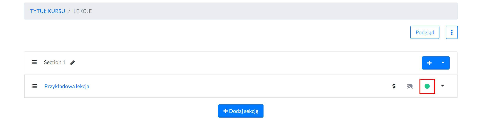

Nieopublikowane lekcje nie są widoczne dla uczestnika kursu.  

 

#### Publikacja kursu 

Aby opublikować kurs należy kliknąć szary przełącznik. **Po kliknięciu kolor zmieni się na niebieski,** co oznacza, że kurs został opublikowany. 

Nieopublikowany kurs **nie będzie widoczny na LIŚCIE KURSÓW na stronie głównej,** ani w panelu nauki studenta w zakładce WSZYSTKIE KURSY. 

Jeśli jednak kurs zostanie ustawiony jako szkic (odpublikowany) po tym, jak użytkownik go kupił. To uczestnik kursu dalej będzie miał do niego dostęp i będzie on widoczny na jego platformie w zakładce MOJE KURSY. 

 

#### Duplikowanie lekcji

1. Aby zduplikować lekcję należy wejść na **Listę lekcji**.

2. A następnie wybrać opcję *Duplikuj*.

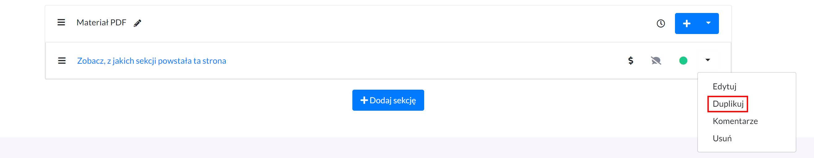

3. Pojawi się krótki formularz, w którym trzeba **wpisać ID kursu**, do którego ma zostać skopiowana lekcja.

**ID kursu można znaleźć na Liście wszystkich kursów.** 

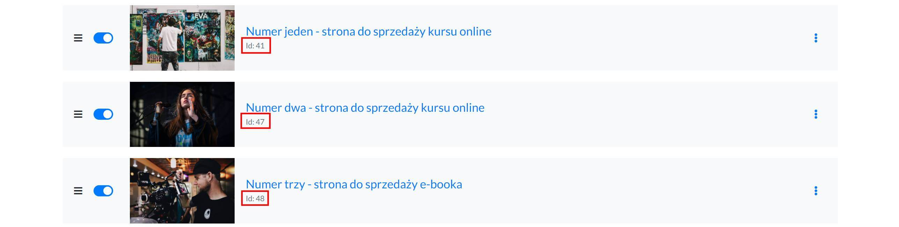

**Lekcja została skopiowana i możesz ją znaleźć na Liście lekcji kursu, którego ID podałeś.** 

 

#### Duplikowanie kursu

Aby zduplikować kurs należy wybrać **Duplikuj** przy opcjach kursu. 

Zduplikowany kurs pojawi się na dole listy.

**Duplikacja kursu duplikuje: stronę sprzedażową oraz listę lekcji.** 

 

#### Ustalanie ceny

1. Aby dodać cenę należy wejść do **Edycji kursu.**

2. A następnie przejść do sekcji **CENA.** 

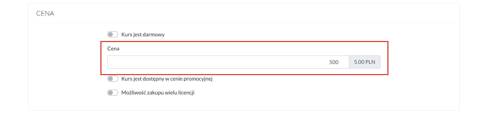

Cena kursu nie może być niższa niż 5 zł. 

 

#### Ustalanie ceny promocyjnej

1. Aby dodać cenę należy wejść w **Edycję kursu.**

2. Następnie przejść do sekcji **CENA** i zaznaczyć opcję *Kurs jest dostępny w cenie promocyjnej.* 

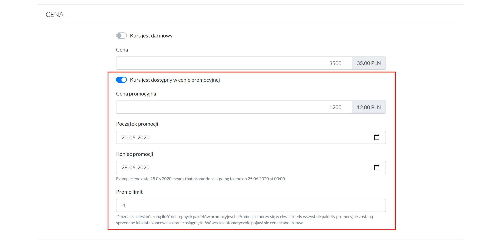

**Na stronie sprzedażowej informacja na temat trwania promocji będzie przedstawiona w taki sposób.** 

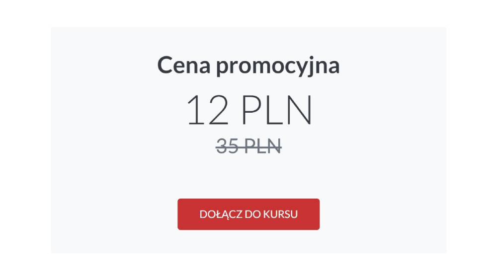

**Przy ustalaniu ceny promocyjnej należy podać:**
* **cenę standardową**
* **cenę promocyjną**
* **okres trwania promocji** 

Po zakończeniu promocji cena promocyjna zmieni się automatycznie na cenę standardową. 

**Przykład:** Koniec trwania promocji to 23 czerwiec. Zmiana ceny nastąpi 23 czerwca o godzinie 00.00. Jeśli cena promocyjna ma obowiązywać do końca 23 czerwca należy ustawić datę 24 czerwca. 

Aby udostępnić ograniczoną ilość kursów w cenie promocyjnej należy skorzystać z opcji **Promo limit.** 

Podaj ilość dostępnych kursów w niższej cenie. W tym wypadku zmiana ceny z promocyjnej na standardową nastąpi w momencie sprzedaży wszystkich kursów w niższej cenie lub w momencie zakończenia promocji (według ustawionej daty). W zależności od tego, która sytuacja nastąpi pierwsza. 

**-1 oznacza nieskoczoną ilość kursów dostępnych w cenie promocyjnej.**

**W momencie ustawienia Ceny promocyjnej, nie zadziała funkcja Kodów rabatowych.**

 

#### Ustalanie ceny dla wielu licencji

1. Aby dodać cenę należy wejść w **Edycję kursu.**

2. Przejść do sekcji **CENA** i zaznaczyć opcję *Możliwość zakupu wiele licencji.* 

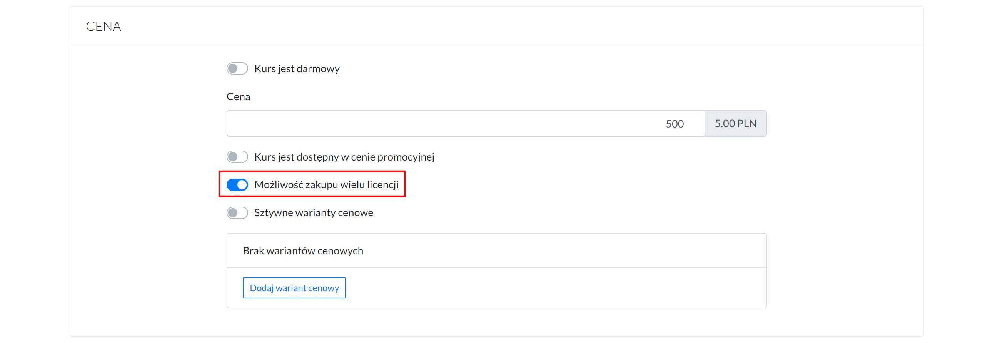

3. A następnie dodać różne warianty cenowe, poprzez wybranie opcji *Dodaj wariant cenowy.*

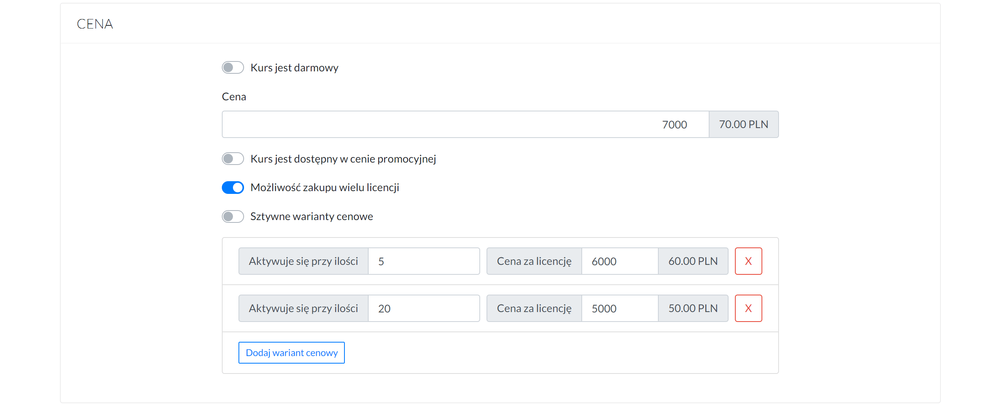

Kiedy użytkownik będzie chciał kupić 1-4 licencje, to za każdą zapłaci po 70 zł, 5-19 licencji, to za każdą zapłaci 60 zł, powyżej 20 licencji, to za każdą zapłaci 50 zł. 

Natomiast, kiedy dodatkowo zostanie włączona opcję *Sztywne warianty cenowe* można narzucić ile licencji może kupić użytkownik. W poniższym przykładzie jest to: 1, 5 lub 20. 

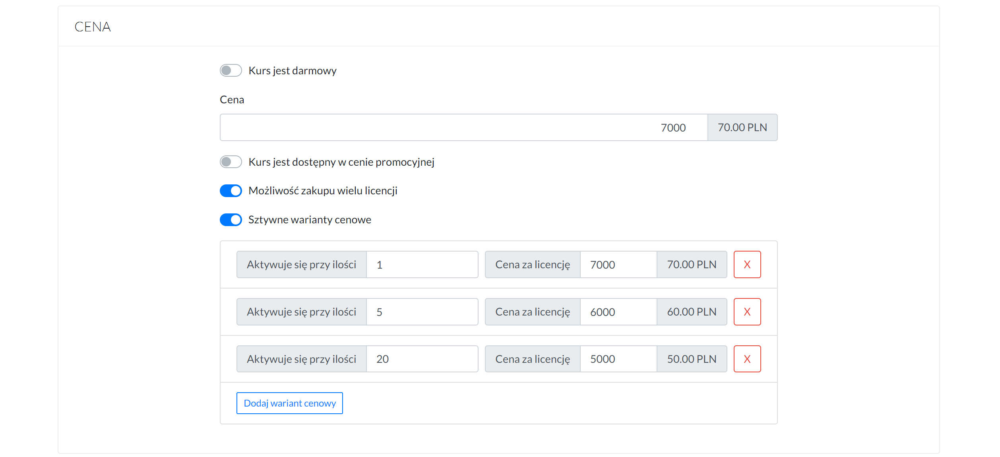

I wówczas na stronie płatności wybór ilości licencji wygląda tak:

Po zakupie użytkownik przechodzi do panelu Zarządzania dostępami, gdzie podaje adresy e-mail osób, które powinny mieć dostęp do kursu. 

Osoby przynająca dostępy ma do dyspozycji tylko tyle dostępów, ile zostało wykupionych. 

Dostęp do kursu jest przyznawany w momencie, kiedy użytkownik przyjmnie zaproszenie. 

Jeśli zaproszenie nie zostanie przyjęte, osoba zarządzająca dostępami może takie zaproszenie usunąć i wysyłać dla innej osoby.

Jeśli osoba zarządzająca dostępami chce mieć dostęp do kursu to musi zaproszenie wysłać również sobie.

W przypadku sprzedaży kursów w modelu wielu licencji nie działa funkcja **Kodów rabatowych.**

 

#### Ustawianie kursu jako darmowy

1. Aby ustawić kurs jako darmowy należy wejść w **Edycję kursu.**

2. Następnie przejść do sekcji **CENA** i zaznaczyć opcję *Kurs jest darmowy.* 

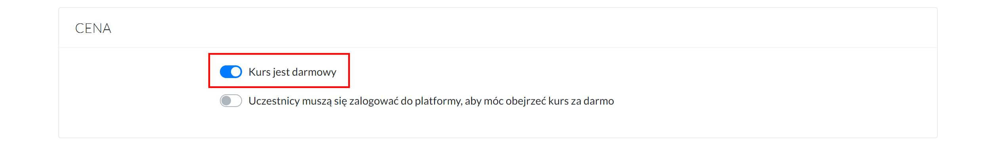

**Na stronie sprzedażowej zamiast przycisku umożliwiającego zakup kurs pojawi się przycisk OGLĄDAJ TERAZ. Po kliknięciu w przycisk użytkownik przejdzie od razu do oglądania kursu.** 

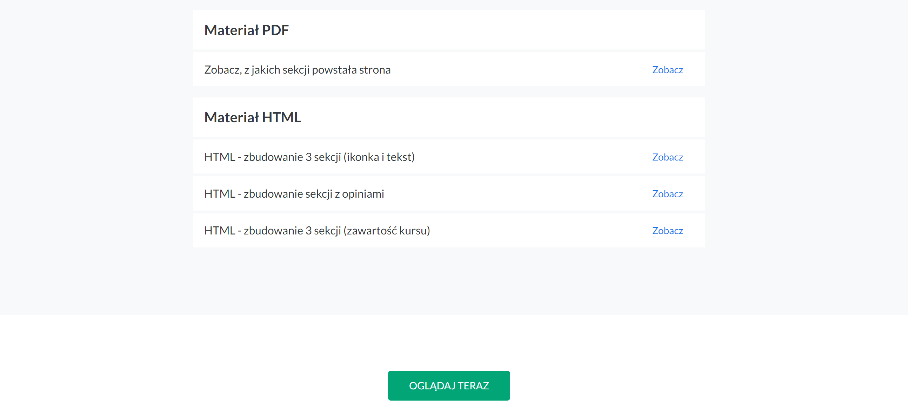

 

#### Ustawianie kursu jako możliwego do obejrzenia po zostawieniu adresu e-mail.

1. Aby ustawić kurs jako darmowy należy wejść w **Edycję kursu.**

2. Następnie przejść do sekcji **CENA** i zaznaczyć opcję *Kurs jest darmowy oraz Uczestnicy muszą się zalogować do platformy, aby móc objerzeć kurs za darmo.*

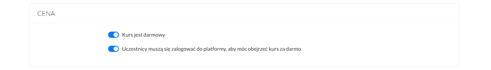

**Na stronie sprzedażowej zamiast przycisku umożliwiającego zakup kurs pojawi się przycisk OGLĄDAJ TERAZ.**

Po kliknięciu w przycisk **OGLĄDAJ TERAZ** użytkownik przejdzie do rejestracji/logowania w celu otrzymania dostępu do kursu.

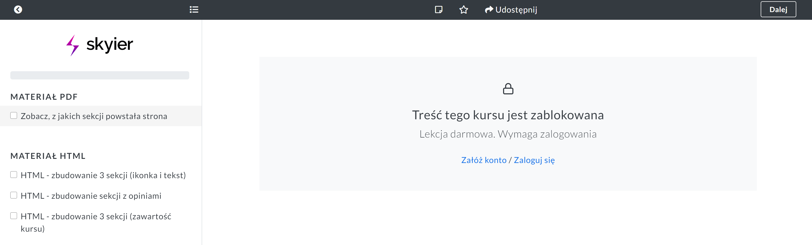

 

#### Ustawianie czasu dostępu do kursu 

1. Aby ustawić określony czas dostępu do kursu należy wejść w **Edycję kursu.**

2. Następnie przejść do sekcji **SZCZEGÓŁY** i wpisać przez ile dni kurs ma być dostępny dla studenta po zakupie.

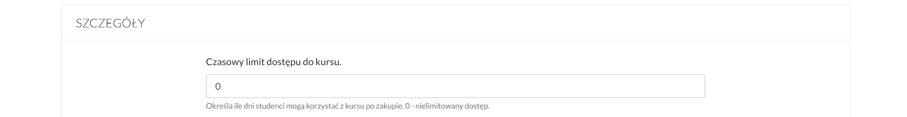

**0 - oznaczania nieograniczony dostęp.** 

#### Ustawienie lekcji jako darmowej

1. Aby ustawić wybraną lekcją jako darmową do obejrzenia należy wejść w **Listę lekcji.**

2. Następnie kliknąć w ikonkę **$**. 

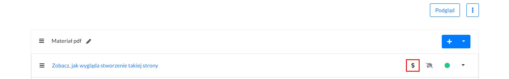

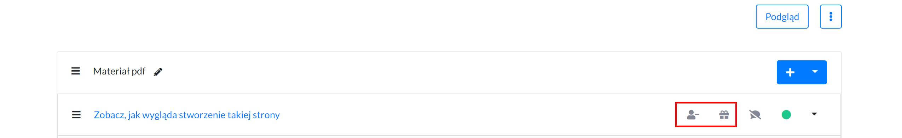

Na liście lekcji (pod warunkiem, że na stronie sprzedażowej zostanie dodany komponent LISTA LEKCJI), pokaże się call to action *Zobacz*, po kliknięciu, w który użytkownik przejdzie do obejrzenia lekcji. 

 

#### Ustawienie lekcji jako możliwej do obejrzenia po zostawieniu e-mail

1. Aby ustawić wybraną lekcją jako darmową do obejrzenia należy wejść w **Listę lekcji.**

2. Kliknąć w ikonkę **$**. 

3. Następnie kliknąć w ikonkę **user-**, aby przestawiła się na **user+**. 

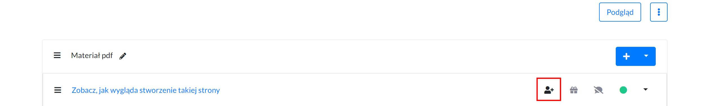

Na liście lekcji (pod warunkiem, że na stronie sprzedażowej zostanie dodany komponent LISTA LEKCJI), pokaże się call to action *Zobacz*, po kliknięciu, w który użytkownik będzie musiał zalogować się, aby przejść do obejrzenia lekcji. 

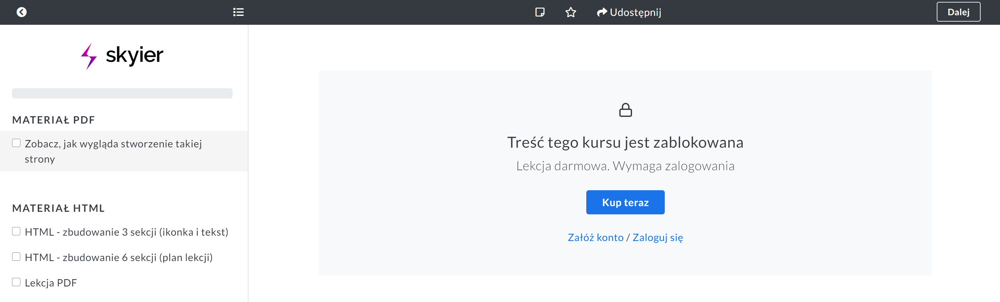

Lekcję możliwią do obejrzenia po zostawieniu e-mail można ustawić tylko przy kursie płatnym. Dlatego użytkownik również ma możliwość dokonania od razu zakupu kursu, wybierając opcję **Kup teraz.** 

 

#### Dodawanie wideo, audio, pdf, doc, excel

1. Aby dodać materiały szkoleniowe należy przejść do **Listy lekcji.**

2. Następnie utworzyć strukturę kursu, dzieląc go na **moduły i lekcje.** 

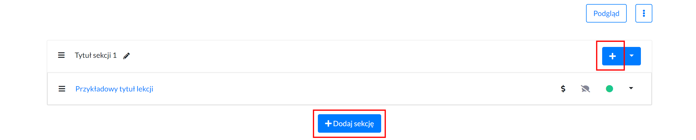

Można dodać nieograniczoną ilość modułów oraz lekcji wchodzących w skład poszczególnych modułów. 

3. Kliknij w **tytuł lekcji** lub opcję **Edytuj**, aby przejść do dodawania materiałów wchodzących w skład lekcji.

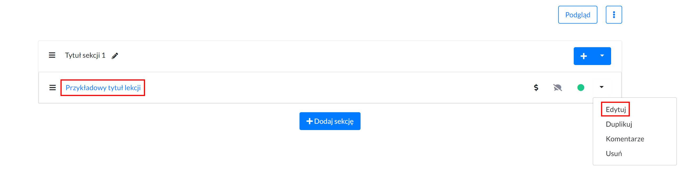

4. **Wybierz komponent z lewej strony, a anstępnie przenieś go na prawą (TEKST, ZDJĘCIE, WIDEO, PDF, itd.).** Można dodać nieograniczoną ilość komponentów i komponenty mogą się powtarzać. 

 

### Platforma subskrypcyjna

#### Włączenie sprzedaży subskrypcyjnej
Aby włączyć model sprzedaży subskrypcyjnej należy przejść do **Ustawień strony -> Model pobierania płatności -> zaznaczyć opcję *Model subskrypcyjny*.**
#### Włączenie sprzedaży subskrypcyjnej i jednorazowej
Aby włączyć model sprzedaży subskrypcyjnej i jednorazowej należy przejść do **Ustawienia konta -> Model pobierania płatności -> zaznaczyć jednocześnie opcje *Jednorazowe płatności i Model subskrypcyjny*.**

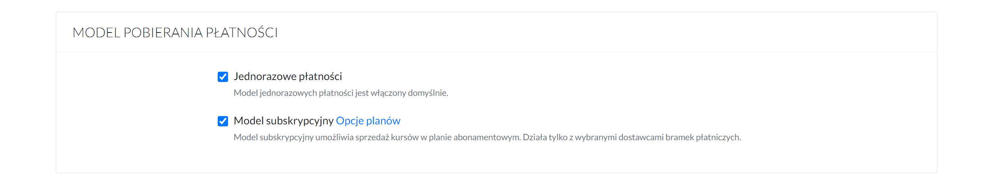

#### Ustalenie pakietów subskrypcyjnych

1. Aby ustawić pakiety subskrypcyjne należy przejść do **Ustawiń konta -> Model pobierania płatności, a następnie przy opcji *Model subskrypcyjny* wybrać opcję: *Opcje planów*.**

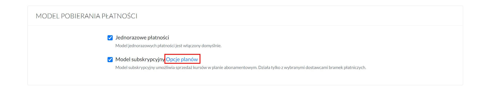

2. A następnie wybrać odpowiednie **plany subskrypcyjne.**

**Można włączyć subskrypcje: miesięczną, 3-miesięczną, 6-miesiączną, 12-miesiączną i na zawsze (czyli tzw. life time).** 

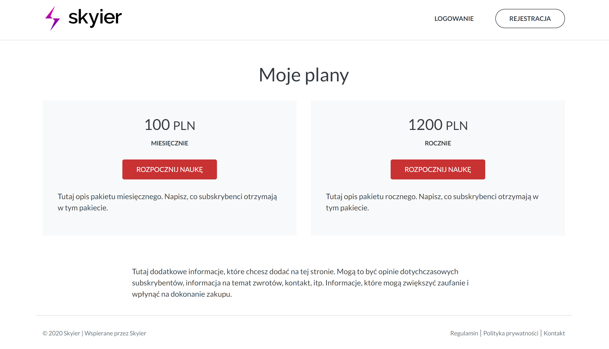

### Strony dodatkowe

#### Polityka prywatności

Aby dodać Politykę prywatności należy przejść do **Ustawień strony -> Informacje prawne -> Polityka prywatności.** 

#### Regulamin

Aby dodać Politykę prywatności należy przejść do **Ustawień strony -> Informacje prawne -> Regulamin.** 

#### Dodatkowe linki w górnej nawigacji

Aby dodać linki należy przejść do **Ustawienia strony -> Funkcje -> Wyświetlaj dodatkowe linki w nawigacji**. A następnie dodać dodatkowe nazwy i linki. 

### Statystyki

#### Statystyki sprzedaży kursu online

Aby sprawdzić ilość przeprowadzonych transkacji należy wybrać w górnym menu zakładką SPRZEDAŻ. 

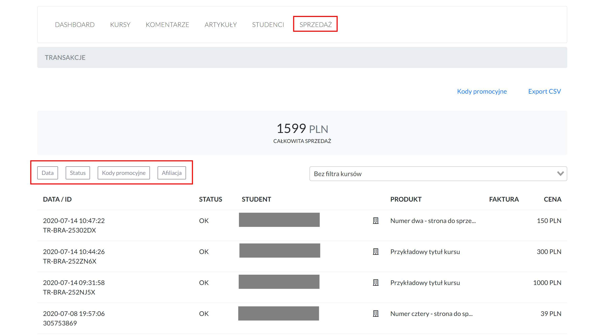

Dane na temat sprzedaży można filtrować po:
* **dacie** - umożliwia zawężenie sprzedaży do określonego przedziału czasowego
* **statusie** - umożliwia sprawdzenie, ile transkacji zostało ukończonych, a ile nie.

Transkacje otrzymują status:

-> OK/PERFORMED - oznacza transkację, która została zakończona. Użytkownik przeszedł przez cały proces zakupowy i otrzymał dostęp do kursu. 

-> STARTED - oznacza transkację, która została rozpoczęta, ale nie ukończona. Użytkownik nie zakończył procesu zakupowego i nie otrzymał dostępu do kursu (tzw. porzucony koszyk).

* **kodach promocyjnych** - umożliwia sprawdzenie, ile transkacji zostało dokonanych przy użyciu danego kodu 
* **afiliacji** - umożliwia sprawdzenie, ile transkacji zostało dokonanych przy użyciu danego linku partnerskiego. Ta opcja pojawia się w momencie uruchomienia sprzedaży przy pomocy linków afiliacyjnych. 
* **kursie** - umożliwia sprawdzenie wysokości sprzedaży konkretnego kursu 

Można również zastosować kilka filtrów równocześnie. 

 

#### Statystyki uczestników

Aby sprawdzić ilu studentów jest zarejestrowanych w platformie należy wybrać w górnym menu zakładkę STUDENCI. 

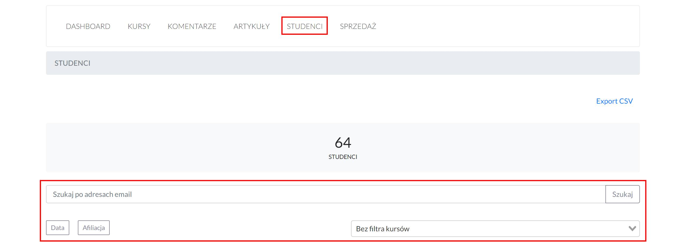

Dane na temat sprzedaży można filtrować po:
* **mailu** - umożliwia wyfiltrowanie konkretnego studenta
* **dacie** - umożliwia zawężenie dokonanych rejestracji w określonym czasie
* **afiliacji** - umożliwia sprawdzenie, ilu uczestników zarejestrowało się przy użyciu danego linku partnerskiego. Ta opcja pojawia się w momencie uruchomienia promocji przy pomocy linków afiliacyjnych. 
* **kursie** - umożliwia sprawdzenie, ilu uczestników jest w danym kursie. Na liście pojawiają się wyłącznie studenci, którzy dokonali zakupu kursu lub, którym został przyznany dostęp. Nie pojawiają się uczestnicy, którzy dokonali rejestracji, w celu zapoznania się z materiałem darmowym. 

 

#### Statystyki zaangażowania

Aby sprawdzić zaangażowanie uczestników kursu należy przejść do  Statystyk danego kursu. 

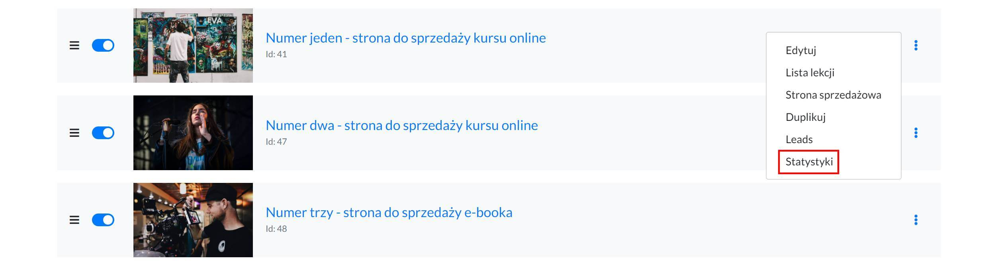

Wówczas pokaże się kilka danych, które można wykorzystać do analizy.

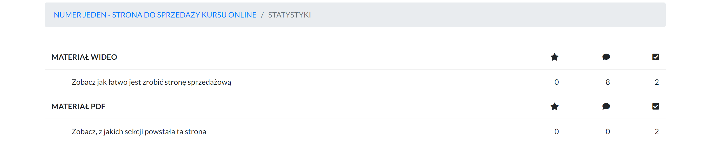

Ikonka:
* **gwiazdki** - oznacza ilość uczestników, którzy oznaczyli lekcję jako ulubioną. Studenci w panelu nauki mają możliwość oznaczania lekcji jako ulubionej, aby móc do niej szybciej wrócić w razie potrzeby. 
* **komentarzy** - oznacza ilość komentarzy zostawionych pod lekcją
* **haczyka** - oznacza, ilość uczestników, którzy oznaczyli lekcję jako ukończoną. Studenci w panelu nauki mogą odznaczać, lekcje, które zostały przez nich obejrzane i śledzić swój postęp nauki. 

 

#### Statystyki leadów

Aby sprawdzić ilu subskrybentów zapisało się na listę przy danym kursie należy wybrać **Leady** przy danym kursie. 

### Pozostałe funkcjonalności 

#### Komentarze

1. Aby włączyć możliwość dodawania komentarzy pod lekcję należy przejść do **Listy lekcji**.

2. A następnie przy wybranej lekcji kliknąć **ikonkę "komentarza".**

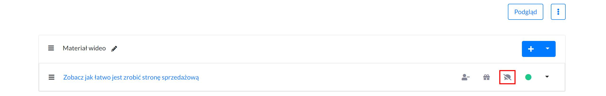

Wówczas szara przekreślona ikonka zmieni się na czarną ikonkę bez przekreślenia. To oznacza, że możliwość dodawania komentarzy została włączona. 

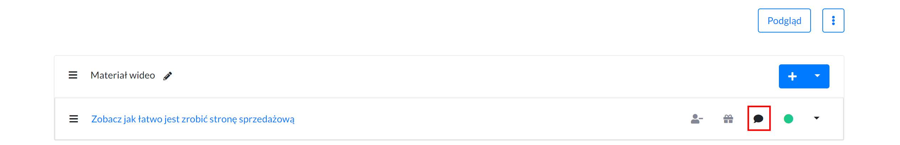

Aby otrzymywać na maila powiadomienia o nowych komentarzach należy przejść do **Ustawień strony -> Powiadomienia** -> i zaznaczyć opcję *Chcę otrzymywać powiadomienia o nowych komentarzach.* 

Aby sprawdzić wszystkie swoje komentarze, należy wybrać zakładkę **KOMENTARZE** w górnym menu. 

 

#### Artykuły 

1. Aby włączyć możliwość dodawania artykułów należy przejść do **Ustawień strony -> Funkcje, a następnie włączyć opcję:** *Włącz funkcję dodawania artykułów.* 

Nazwa, którą podasz będzie widoczna w górnej nawigacji. Może to być na przykład Blog.

**2. Następnie wybierz w górnym menu zakładkę ARTYKUŁY**

**3. Kliknij w przycisk +Dodaj artykuł.**

Aby opublikować artykuł należy kliknąć szary przełącznik. **Po kliknięciu kolor zmieni się na niebieski,** co oznacza, że artykuł został opublikowany. 

 

#### Kody rabatowe

1. Aby stworzyć kod rabatowy wybierz w górnym menu zakładkę **SPRZEDAŻ.**

2. A następnie **Kody promocyjne.**

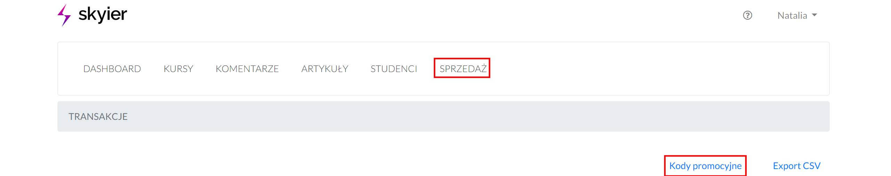

3. Kliknij w **przycisk +Dodaj** i pojawi się krótki formularz do wypełnienia.

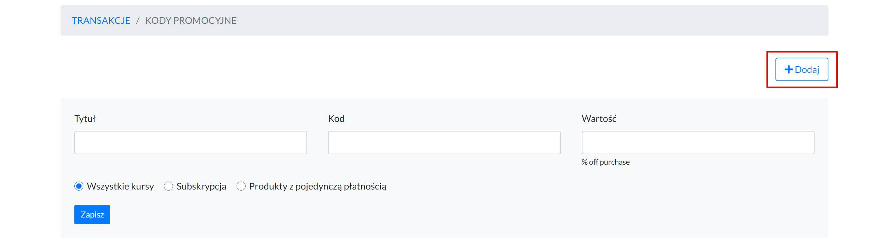

Podaj:
* **tytuł** - tak, abyś wiedział, po co ten kod został stworzony
* **kod** - nazwa, jaką użytkownicy będą musieli wpisać, aby rabat został naliczony
* **wartość** - wielkość rabatu, jaki chcesz przyznać, np. 30

**4. Wybierz kursy, jakie ten kod będzie obejmował:**

* **wszystkie kursy** - kod będzie naliczał rabat na wszystkie produkty, jakie posiadasz w ofercie. Czyli na kursy pojedyncze, pakiety i subskrypcję. 
* **subskrypcja** - kod będzie obejmował wyłącznie rabat na ofertę subskrypcyjną. 
* **produkty z pojedynczą płatnością** - kod będzie naliczał rabat tylko na wybrany kurs pojedynczy lub pakiet. 

**5. Aktywuj kod rabatowy.** Aby to zrobić należy kliknąć w szary przełącznik. **Po kliknięciu kolor zmieni się na niebieski,** co oznacza, że kod został aktywowany. 

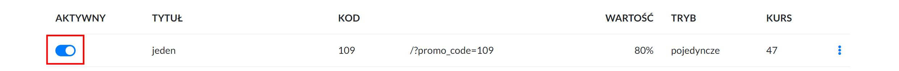

Jeśli chcesz, aby rabat naliczał się po wpisaniu kodu w Pole rabatowe na stronie płatności to należy wejść w **Ustawienia strony -> Funkcje** -> i zaznaczyć opcję *Wyświetlaj pole do wpisania kodu rabatowego na stronie zakupowej.* 

Pole to pojawi się nad przyciskiem KUP TERAZ.

Jeśli natomiast chcesz, aby rabat się naliczał od razu po przejściu na stronę z linku. To należy do adresu url strony dodać na końcu odpowiedni parametr, np: /?promo_code=109.

I wówczas taki link przyjmie postać https://inspiracje.skyier.pl/numer-piec-strona-do-sprzedazy-kursu-online/checkout/?promo_code=70. I rabat zostanie naliczony automatycznie, bez konieczności wpisywania kodu w Pole rabatowe. 

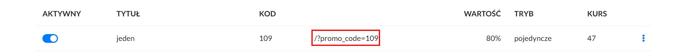

 

#### Ukryj na liście kursów

1. Aby ukryć kurs na Liście kursów należy wejść w **Edycję kursu.** 

2. A następnie przejść do **sekcji SZCZEGÓŁY** i zaznaczyć opcję *Ukryj na liście kursów*. Szary przełącznik **po kliknięciu zmieni kolor na niebieski,** co oznacza, że kurs został ukryty. 

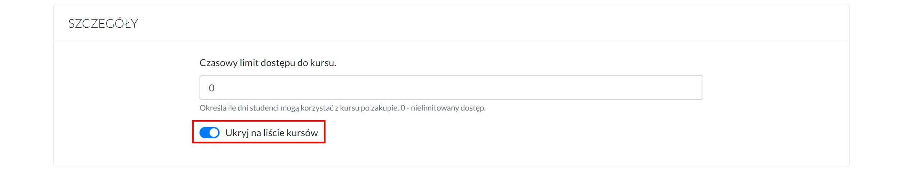

**Kurs nie będzie widoczny na Liście kursów** (na stronie głównej).

oraz na **liście WSZYSTKIE KURSY**, po zalogowaniu przez uczestnika do platformy.

**Link do "ukrytego" kursu można udostępnić tylko dla wybranych osób. Osoby, które zakupią kurs będą go widziały na LIŚCIE SWOICH KURSÓW, po zalogowaniu do swojej platformy.** 

 

#### Opóźnianie lekcji

1. Aby włączyć opóźnienia lekcji, należy przejść do **Listy lekcji**. 

2. A następnie na poziomie sekcji wybrać opcję *Ustaw opóźnienie sekcji*.

3. I podać, po **ilu dniach od zakupu** ma być dostępna sekcja z lekcjami. 

**Opóźnienie ustawia się na poziomie całej sekcji, a nie poszczególnych lekcji.** Jeśli chcesz, aby opóźnienie dostępu następowało na każdej lekcji, wówczas każda lekcja powinna być w oddzielnej sekcji. 

**I co ważne, opóźnienie odbywa się w stosunku do dnia zakupu kursu.**

Jeśli ustawisz opóźnienie drugiej sekcji o 2 dni, a opóźnienie trzeciej seksji o 4 dni. To w momencie, kiedy użytkownik kupi kurs 23 czerwca to od razu po zakupie będzie miał dostęp do pierwszej sekcji, 25 czerwca do drugiej, a 27 czerwca do trzeciej. 

 

#### Leady

Aby zacząć zbierać leady (adresy e-mail) należy na **stronie sprzedażowej dodać komponent ZBIERANIE LEADÓW.**

Wówczas na stronie pojawi się **krótki formularz, z polami: e-mail i imię.** 

Statystyki na temat ilości zebranych leadów można znaleźć **w zakładce Leads.** 

**Komponent ZBIERANIE LEADÓW można dodać tylko na stronach sprzedażowych.**

Jeśli natomiast chcesz zbierać leady również na stronie głównej to należy stworzyć formularz w swoim narzędzie do e-mail marketingu (MailerLite, GetResponse, itp.), a następnie zaembedować kod za pomocą komponentu HTML. 

