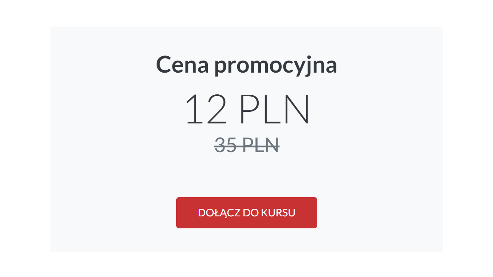

### Ustawienia strony

W poniższym filmiku znajdziesz instrukcję, jak szybko przejść przez Ustawienia strony i na co warto zwrócić uwagę. 

<iframe width="100%" height="550" src="https://player.vimeo.com/video/435808766/?portrait=0&title=0&byline=0" /></iframe>

#### Ustawienia
* **Nazwa strony** - nazwa ta będzie widoczna w lewym górnym rogu (tam, gdzie najczęściej wstawiane jest logo). Jeśli natomiast dodasz logo w poniższej sekcji OBRAZY to wówczas Nazwa strony zostanie zastąpiona logo. 
* **Domena** - adres url, pod jakim będzie dostępna platforma do sprzedaży kursów. Przykład: kursy.nataliablizniuk.pl.
* **Język strony** - wersja językowa, w jakim będzie dostępna platforma dla studentów. Można wybrać wersję polską lub angielską.
* **Waluta** - waluta, w jakiej będą pobierane opłaty za kursy online. Dostępne waluty: PLN, USD, GBP, EUR, CHF. 

#### Funkcje 
* **Włącz funkcję dodawania artykułów** - zaznacz, jeśli chcesz na platformie dodawać artykuły. Nazwa, którą podasz będzie widoczna w górnej nawigacji. Może to być na przykład Blog.

* **Wyświetlaj wiadomość powitalną** - zaznacz, jeśli chcesz wyświetlać wiadomość dla studentów, którzy kupili kurs za pomocą płatności jednorazowych albo po prostu zarejestrowali się do platformy w celu zapoznania się z Twoimi kursami darmowymi (jeśli takie posiadasz) lub płatnymi. Wiadomość będzie widoczna od razu po zalogowaniu do platformy.

* **Wyświetlaj wiadomość powitalną dla subskrybentów** - zaznacz, jeśli chcesz wyświetlać wiadomość dla studentów, którzy dołączyli do Twojej platformy subskrypcyjnej. Wiadomość będzie widoczna od razu po zalogowaniu do platformy. I będzie wyglądała analogicznie do przykładu zamieszczonego powyżej. 
* **Chcę wystawiać faktury manulanie** - zaznacz, jeśli chcesz, aby faktura nie została automatycznie wysłana po zakupie kursu, tylko "na żądanie". Aby ta funkcja zadziała potrzeba jest integracja z systemem do fakturowania.
* **Wyświetlaj pole do wpisania kodu rabatowego na stronie zakupowej** - zaznacz, jeśli chcesz, aby na stronie płatności pojawiło się pole do wpisania kodu promocyjnego dla użytkowników. Pole to pojawi się nad przyciskiem Kup teraz.

* **Chcę użyć zewnętrznych stron sprzedażowych** - zaznacz, jeśli chcesz stworzyć stronę sprzedażową na WordPressie albo w innym narzędziu do landing page. Wówczas platforma będzie wykorzystywana jako panel do nauki.
* **Wyświetlaj dodatkowe linki w nawigacji** - zaznacz, jeśli chcesz dodać dodatkowe linki w górnej nawigacji. Mogą to być linki przekierowujące np. do Twojej domeny głównej. 

 

#### Model pobierania płatności
* **Jednorazowe płatności** - zaznacz, jeśli planujesz sprzedaż kursów online jako jednorazowy zakup.
* **Model subskrypcyjny** - zaznacz, jeśli planujesz uruchomić platformę subskrypcyjną. Systemem płatności, który obsługuje płatności abonamentowe to TPay. 
* **Jednorazowe płatności i Model subskrypcyjny** - zaznacz, jeśli planujesz sprzedaż kursów zarówno w modelu jednorazowym, jak i subskrypcyjnym. 

 

#### Powiadomienia
* **Chcę otrzymywać powiadomienia o ukończonych transakcjach** - zaznacz, jeśli chcesz otrzymywać maile z informacją, że ktoś kupił kurs. Powiadomienie będzie przychodziło na adres e-mail podany przy Rejestracji.
* **Chcę otrzymywać powiadomienia o nowych komentarzach** - zaznacz, jeśli chcesz otrzymywać powiadomienia na temat komentarzy pod Twoimi lekcjami. Aby ta funkcja zadziałała przy lekcjach trzeba włączyć możliwość pozostawiania komentarzy przez studentów. Powiadomienie będzie przychodziło na adres e-mail podany przy Rejestracji.

 

#### Dane autora
* **Nazwa firmy/Imię i nazwisko**
* **E-mail** - adres e-mail będzie dostępny pod nazwą **Kontakt** w nawigacji dolnej.
* **Copyright** - możesz podać nazwę, która będzie widoczna w dolnej nawigacji. Jeśli zostawisz to pole puste to pojawi się Nazwa strony, podana w pierwszym polu. W poniższym przykładzie nazwa wpisana w Copyright to Skyier.
* **Copyright url** - możesz podać link strony, do której ma przekierowywać nazwa podana w Copyright.

 

#### Informacje prawne
* **Regulamin** - miejsce na regulamin platformy do sprzedaży kursów.
* **Polityka prywatności** - miejsce na politykę prywatności platformy do sprzedaży kursów.

 

#### JavaScript
Tutaj wklej kod śledzący. Rekmendowany jest Google Tag Managera. 

 

#### Obrazy
* **Favicon** - ikonka, która pojawi się w polu adresowym przeglądarki internetowej czy na karcie w przeglądarce internetowej. W przypadku braku favicony pojawi się favicona Skyier. 
* **Logo** - logo pojawi się w lewym górnym rogu na stronie głównej platformy oraz w panelu do nauki. 

* **Facebook OG Image** - zdjęcie, które się pojawi w momencie udostępniaania strony głównej platformy na Facebook'u.

 

### Tworzenie kursu online

#### Dodawanie kursu online

W poniższym filmiku znajdziesz instrukcję, jak szybko dodać swój pierwszy kurs. 

<iframe width="100%" height="550" src="https://player.vimeo.com/video/435808647/?portrait=0&title=0&byline=0" /></iframe>

**1. Po zalogowaniu do platformy wybierz zakładkę KURSY.**

**2. Następnie kliknij w przycisk + Dodaj kurs.**

**3. Wpisz tytuł kursu online. Ten tytuł będzie można później zmienić.** 

**4. Wypełnij OPIS kursu.**
* Tytuł - tytuł kursu, możesz go zmieniać. To pole jest wymagane.
* URL - nazwa, jaka będzie zawarte w adresie URL. Ta nazwa tworzy się automatycznie na podstawie tytułu podanego we wcześniejszym kroku. Jeśli zmienisz nazwę kursu to potem możesz też zmienić nazwę adresu url. To pole jest wymagane.
* Opis - kilka zdań na temat kursu online. To pole nie jest wywmagne.
* Poziom trudności - możesz określić poziom trudności swojego kursu, aby użytkownicy wiedzieli, czy ten kurs jest dla nich. To pole nie jest obowiązkowe.

**5. Wgraj OBRAZ** 

Wgrane zdjęcie będzie widoczne na Liscie wszystkich kursów oraz na stronie płatności (checkout).

**6. Przejdź do Listy lekcji**

**7. Stwórz plan swojego kursu. Rozpisując go na SEKCJE i LEKCJE.** 

**8. Wybierz komponenty, z jakich będzie składała się lekcja.** 

Wybierz interesujący Cię komponent (TEKST, WIDEO, PLIK, itd.), a następnie przesuń go na prawą stronę.
Twoje lekcja może składać się z wielu komponentów. Komponenty też mogą się powtarzać. Czyli można wybrać np. dwa razy TEKST czy 3 razy PLIK.

W przypadku PLIKU możesz wgrać mp3, pdf, doc, docs, xls, xlsx. 

 

#### Publikacja lekcji

Aby opublikować lekcję należy kliknąć na czerwoną "kropkę" widoczną przy lekcji. Po kliknięciu **kolor zmieni się na zielony,** co oznacza, że lekcja została opublikowana. 

Nieopublikowane lekcje nie są widoczne dla uczestników kursu.  

 

#### Publikacja kursu 

Aby opublikować kurs należy kliknąć na szary przełącznik. **Po kliknięciu kolor zmieni się na niebieski,** co oznacza, że kurs został opublikowany. 

Nieopublikowany kurs **nie będzie widoczny na LIŚCIE KURSÓW na stronie głównej,** ani w panelu nauki studenta w zakładce WSZYSTKIE KURSY. 

Jeśli jednak kurs zostanie ustawiony jako szkic po tym, jak użytkownik go kupił. To uczestnik kursu dalej będzie miał do niego dostęp i będzie on widoczny na jego platformie w zakładce MOJE KURSY. 

 

#### Ustalanie ceny

1. Aby dodać cenę należy wejść w **Edycję kursu.**

2. Następnie przejść do sekcji **CENA.** 

Cena kursu nie może być niższa niż 5 zł. 

 

#### Ustalanie ceny promocyjnej

1. Aby dodać cenę należy wejść w **Edycję kursu.**

2. Następnie przejść do sekcji **CENA.** 

Na stronie sprzedażowej informacja na temat trwania promocji będzie przedstawiona w taki sposób. 

Przy ustalaniu ceny promocyjnej należy podać:
* cenę standardową
* cenę promocyjną
* okres trwania promocji 

Po zakończeniu promocji cena promocyjna zmieni się automatycznie na cenę standardową. 

