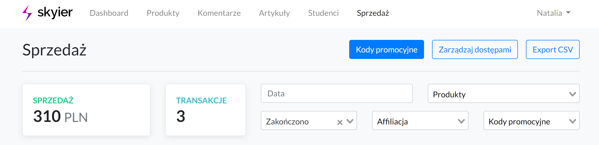

### Ustawienia strony

W poniższym filmiku znajdziesz instrukcję, jak szybko przejść przez Ustawienia strony i na co warto zwrócić uwagę. 

<iframe width="100%" height="550" src="https://player.vimeo.com/video/435808766/?portrait=0&title=0&byline=0" /></iframe>

#### Ustawienia
* **Nazwa strony** - nazwa ta będzie widoczna w lewym górnym rogu (tam, gdzie najczęściej wstawiane jest logo). Jeśli natomiast dodasz logo w poniższej sekcji OBRAZY to wówczas Nazwa strony zostanie zastąpiona logo. 
* **Domena** - adres url, pod jakim będzie dostępna platforma do sprzedaży kursów. Przykład: kursy.nataliablizniuk.pl.
* **Język strony** - wersja językowa, w jakim będzie dostępna platforma dla studentów. Można wybrać wersję polską lub angielską.
* **Waluta** - waluta, w jakiej będą pobierane opłaty za kursy online. Dostępne waluty: PLN, USD, GBP, EUR, CHF. 

 

#### Dane autora
* **Nazwa firmy/Imię i nazwisko**
* **E-mail** - adres e-mail będzie dostępny pod nazwą **Kontakt** w nawigacji dolnej.
* **Copyright** - nazwa ta będzie widoczna w dolnej nawigacji. Jeśli zostawisz to pole puste to pojawi się Nazwa strony, podana w pierwszym polu. W poniższym przykładzie nazwa wpisana w Copyright to Skyier.
* **Copyright url** - link strony, do której ma przekierowywać nazwa podana w Copyright.

 

#### Funkcje 
* **Włącz funkcję dodawania artykułów** - zaznacz, jeśli chcesz na platformie dodawać content. Nazwa, którą podasz będzie widoczna w górnej nawigacji. Może to być na przykład Blog. [Tutaj dowiesz się, jak dodawać Artykuły.](/?id=artyku%c5%82y) 

* **Wyświetlaj wiadomość powitalną** - zaznacz, jeśli chcesz wyświetlać wiadomość dla studentów, którzy kupili kurs za pomocą płatności jednorazowych albo po prostu zarejestrowali się do platformy w celu zapoznania się z Twoimi kursami darmowymi (jeśli takie posiadasz). Wiadomość będzie widoczna od razu po zalogowaniu do platformy.

* **Wyświetlaj wiadomość powitalną dla subskrybentów** - zaznacz, jeśli chcesz wyświetlać wiadomość dla studentów, którzy dołączyli do Twojej platformy subskrypcyjnej. Wiadomość będzie widoczna od razu po zalogowaniu do platformy. I będzie wyglądała analogicznie do przykładu zamieszczonego powyżej. 
* **Chcę wystawiać faktury manulanie** - zaznacz, jeśli chcesz, aby faktura nie została automatycznie wysłana po zakupie kursu. Wówczas, aby wystawić fakturę trzeba wejść w SPRZEDAŻ i przy danej transkacji kliknąć przycisk *attempt*. Wystawienie faktur zadziała tylko w momencie, kiedy jest zrobiona integracja z systemem do fakturowania (InFakt, Fakturownia, iFirma, Taxe, Taxxo).
* **Wyświetlaj pole do wpisania kodu rabatowego na stronie zakupowej** - zaznacz, jeśli chcesz, aby na stronie płatności pojawiło się pole do wpisania kodu promocyjnego dla użytkowników. Pole to pojawi się nad przyciskiem Kup teraz.

* **Chcę użyć zewnętrznych stron sprzedażowych** - zaznacz, jeśli chcesz stworzyć stronę sprzedażową na WordPressie albo w innym narzędziu. Wówczas platforma będzie wykorzystywana wyłącznie jako panel do nauki i obsługi transkacji. Trzeba pamiętać, aby na swojej stronie sprzedażowej wstawić link przekierowujący na strony zakupowej (checkoutu) Skyier.
* **Wyświetlaj dodatkowe linki w nawigacji** - zaznacz, jeśli chcesz dodać linki w górnej nawigacji.

* **Wyświetlaj własne pola zgody przy zakupie (zamiast standardowych)** - zaznacz, jeśli chcesz na stronie dokonywania zakupu (checkout) wstawić swoje checkboxy. Możesz dodać ich nieograniczoną ilość, ale wszystkie będą wymagane. W momencie dodania swoich formułek, nasza standardowa nie będzie wyświetlana. 

* **Wyświetlaj uproszczoną stronę zakupową** - zazacz, jeśli nie chcesz zbierać danych do wystawiania faktur lub rachunków. Wówczas na stronie zakupowej (checkout) będzie widoczny wyłącznie formularz rejestracyjny. 

 

#### Model pobierania płatności
* **Jednorazowe płatności** - zaznacz, jeśli planujesz sprzedaż kursów online i konsultacji jako jednorazowy zakup.
* **Model subskrypcyjny** - zaznacz, jeśli planujesz uruchomić platformę subskrypcyjną. Systemem płatności, który obsługuje płatności abonamentowe to TPay. 
* **Jednorazowe płatności i Model subskrypcyjny** - zaznacz, jeśli planujesz sprzedaż kursów zarówno w modelu jednorazowym, jak i subskrypcyjnym. 

 

#### Powiadomienia
* **Chcę otrzymywać powiadomienia o ukończonych transakcjach** - zaznacz, jeśli chcesz otrzymywać maile z informacją, że Twój kurs został kupiony. Powiadomienie będzie przychodziło na adres e-mail podany przy Rejestracji.
* **Chcę otrzymywać powiadomienia o nowych komentarzach** - zaznacz, jeśli chcesz otrzymywać powiadomienia na temat komentarzy pod Twoimi lekcjami. Aby ta funkcja zadziałała przy lekcjach trzeba włączyć możliwość pozostawiania komentarzy przez studentów. Powiadomienie będzie przychodziło na adres e-mail podany przy Rejestracji. [Tutaj znajdziesz instrukcję, jak włączyć Komentarze.](/?id=komentarze)

 

#### Informacje prawne
* **Regulamin** - miejsce na regulamin platformy do sprzedaży kursów.
* **Polityka prywatności** - miejsce na politykę prywatności platformy do sprzedaży kursów.

 

#### JavaScript
Tutaj wklej kod śledzący. Rekmendowany jest Google Tag Manager. Ale można również dodać inne kody, w zależności od narzędzia, jakiego chcemy użyć (Google Analytics, FB Pixel, Hotjar, itp.). 

 

#### Obrazy
* **Favicon** - ikonka, która pojawi się w polu adresowym przeglądarki internetowej czy na karcie w przeglądarce internetowej. W przypadku braku favicony pojawi się favicona Skyier. 
* **Logo** - logo pojawi się w lewym górnym rogu na stronie głównej platformy oraz w panelu do nauki. 

* **Facebook OG Image** - zdjęcie, które się pojawi w momencie udostępniaania strony głównej platformy na Facebook'u.

 

### Strona główna z kursami online i strona sprzedażowa kursu

<iframe width="100%" height="550" src="https://player.vimeo.com/video/449606606/?portrait=0&title=0&byline=0" /></iframe>

#### Strona główna z kursami

1. Aby stworzyć stronę główną ze swoimi kursami należy przejść do **Ustawień strony -> Edytuj wygląd strony**

2. **A następnie wybierać komponenty, z jakich powinna być zbudowana strona główna.** Przeciągając je na prawą stronę.

 

#### Strona sprzedażowa kursu online

1. Aby stworzyć stronę sprzedażową kursu należy wybrać **Strona sprzedażowa.** 

2. **A następnie wybierać komponenty, z jakich powinna być zbudowana strona sprzedażowa.** Przeciągając je na prawą stronę.

 

### Tworzenie kursu online

#### Dodawanie kursu online

W poniższym filmiku znajdziesz instrukcję, jak szybko dodać swój pierwszy kurs. 

<iframe width="100%" height="550" src="https://player.vimeo.com/video/435808647/?portrait=0&title=0&byline=0" /></iframe>

**1. Po zalogowaniu do platformy wybierz zakładkę KURSY.**

**2. Następnie kliknij w przycisk + Dodaj kurs.**

**3. Wpisz tytuł kursu online. Ten tytuł będzie można później zmienić.** 

**4. Wypełnij OPIS kursu.**
* Tytuł - tytuł kursu, możesz go zmieniać. To pole jest wymagane.
* URL - nazwa, jaka będzie zawarte w adresie URL. Ta nazwa tworzy się automatycznie na podstawie tytułu podanego we wcześniejszym kroku. Jeśli zmienisz nazwę kursu to potem możesz też zmienić nazwę adresu url. To pole jest wymagane.
* Opis - kilka zdań na temat kursu online. To pole nie jest wywmagne.
* Poziom trudności - możesz określić poziom trudności swojego kursu, aby użytkownicy wiedzieli, czy ten kurs jest dla nich. To pole nie jest obowiązkowe.

**5. Wgraj OBRAZ** 

Wgrane zdjęcie będzie widoczne na Liscie wszystkich kursów oraz na stronie płatności (checkout).

**6. Przejdź do Listy lekcji**

**7. Stwórz plan swojego kursu. Rozpisując go na SEKCJE i LEKCJE.** 

**8. Wybierz komponenty, z jakich będzie składała się lekcja.** 

Wybierz interesujący Cię komponent (TEKST, WIDEO, PLIK, itd.), a następnie przesuń go na prawą stronę.
Twoje lekcja może składać się z wielu komponentów. Komponenty też mogą się powtarzać. Czyli można wybrać np. dwa razy TEKST czy 3 razy PLIK.

W przypadku PLIKU możesz wgrać mp3, pdf, doc, docs, xls, xlsx. 

 

#### Publikacja lekcji

Aby opublikować lekcję należy kliknąć szary przełącznik. **Po kliknięciu kolor zmieni się na niebieski,** co oznacza, że lekcja została opublikowana.  

Nieopublikowane lekcje nie są widoczne dla uczestnika kursu.  

 

#### Publikacja kursu 

Aby opublikować kurs należy kliknąć szary przełącznik. **Po kliknięciu kolor zmieni się na niebieski,** co oznacza, że kurs został opublikowany. 

Nieopublikowany kurs **nie będzie widoczny na LIŚCIE KURSÓW na stronie głównej,** ani w panelu nauki studenta w zakładce WSZYSTKIE KURSY. 

Jeśli jednak kurs zostanie ustawiony jako szkic (odpublikowany) po tym, jak użytkownik go kupił. To uczestnik kursu dalej będzie miał do niego dostęp i będzie on widoczny na jego platformie w zakładce MOJE KURSY. 

 

#### Duplikowanie lekcji w tym samym kursie

1. Aby zduplikować lekcję należy wejść na **Listę lekcji**.

2. A następnie przy wybranej lekcji wybrać opcję *Duplikuj*.

3. Zduplikowana lekcja pojawi się na końcu sekcji.

 

#### Kopiowanie lekcji do innego kursu

1. Aby skopiować lekcję należy wejść na **Listę lekcji**.

2. A następnie przy wybranej lekcji wybrać opcję *Kopiuj do*.

3. I wybrać kurs, do którego chcemy skopiować lekcję. 
4. Skopiowana lekcja pojawi się na Liście lekcji kursu, do którego została skopiowana. 

 

#### Duplikowanie kursu

Aby zduplikować kurs należy wybrać **Duplikuj** przy opcjach kursu. 

Zduplikowany kurs pojawi się na dole listy.

**Duplikacja kursu duplikuje: stronę sprzedażową oraz listę lekcji.** 

 

#### Ustalanie ceny

1. Aby dodać cenę należy wejść do **Edycji kursu.**

2. A następnie przejść do sekcji **CENA.** 

Cena kursu nie może być niższa niż 5 zł. 

 

#### Ustalanie ceny promocyjnej

1. Aby dodać cenę należy wejść w **Edycję kursu.**

2. Następnie przejść do sekcji **CENA** i zaznaczyć opcję *Produkt jest w promocji.* 

**Przy ustalaniu ceny promocyjnej należy podać:**
* **cenę standardową**
* **cenę promocyjną**
* **okres trwania promocji (od-do)** 

Po zakończeniu promocji cena zmieni się automatycznie na cenę standardową. 

Aby udostępnić ograniczoną ilość kursów w cenie promocyjnej należy skorzystać z opcji **Ilość produktów w cenie promocyjnej.** I wówczas należy podać ile kursów dostępnych jest w niższej cenie. W tym wypadku zmiana ceny z promocyjnej na standardową nastąpi w momencie wyprzedaży wszystkich kursów w niższej cenie lub w momencie zakończenia promocji (według ustawionej daty). W zależności od tego, która sytuacja nastąpi pierwsza. 

**-1 oznacza nieskoczoną ilość kursów dostępnych w cenie promocyjnej.**

**W momencie ustawienia Ceny promocyjnej, Kod rabatowy będzie naliczany do ceny standardowej, a nie promocyjnej.**
Przykład: Jeśli ustawimy:  
Cena standardowa kursu - 35 zł 
Cena promocyjna - 12 zł 
Cena po uwzględnieniu kodu rabatowego (zakładając, że ustawimy kod rabatowy na 50%) - 17,5 zł

 

#### Ustalanie ceny dla wielu licencji

1. Aby dodać cenę należy wejść w **Edycję kursu.**

2. Przejść do sekcji **CENA** i zaznaczyć opcję *Zakup kursu na wiele licencji.* 

3. A następnie dodać różne warianty cenowe, poprzez wybranie opcji *Dodaj wariant cenowy.*

Kiedy użytkownik będzie chciał kupić 1-4 licencje, to za każdą zapłaci po 70 zł, 5-19 licencji, to za każdą zapłaci 60 zł, powyżej 20 licencji, to za każdą zapłaci 50 zł. 

Natomiast, kiedy dodatkowo zostanie włączona opcję *Sztywne warianty cenowe* można narzucić ile licencji może kupić użytkownik. W poniższym przykładzie jest to: 1, 5 lub 20. 

I wówczas na stronie płatności wybór ilości licencji wygląda tak:

Po zakupie użytkownik przechodzi do panelu Zarządzania dostępami, gdzie podaje adresy e-mail osób, które powinny mieć dostęp do kursu. 

Osoby przynająca dostępy ma do dyspozycji tylko tyle dostępów, ile zostało wykupionych. 

Dostęp do kursu jest przyznawany w momencie, kiedy użytkownik przyjmnie zaproszenie. 

Jeśli zaproszenie nie zostanie przyjęte, osoba zarządzająca dostępami może takie zaproszenie usunąć i wysyłać dla innej osoby.

Jeśli osoba zarządzająca dostępami chce mieć dostęp do kursu to musi zaproszenie wysłać również sobie.

W przypadku sprzedaży kursów w modelu wielu licencji nie działa funkcja **Kodów rabatowych.**

 

#### Ustawianie kursu jako darmowy

1. Aby ustawić kurs jako darmowy należy wejść w **Edycję kursu.**

2. Następnie przejść do sekcji **CENA** i zaznaczyć opcję *Kurs jest darmowy.* 

**Na przycisku (zamiast call to action DOŁĄCZ DO KURSU) pojawi się call to action OGLĄDAJ TERAZ.** 

 

#### Ustawianie kursu jako możliwego do obejrzenia po zostawieniu adresu e-mail.

1. Aby ustawić kurs jako darmowy należy wejść w **Edycję kursu.**

2. Następnie przejść do sekcji **CENA** i zaznaczyć opcję *Produkt jest darmowy oraz Uczestnicy muszą się zalogować do platformy, aby móc objerzeć kurs za darmo.*

**Na przycisku (zamiast call to action DOŁĄCZ DO KURSU) pojawi się call to action OGLĄDAJ TERAZ.** 

Po kliknięciu w przycisk **OGLĄDAJ TERAZ** użytkownik przejdzie do rejestracji/logowania w celu otrzymania dostępu do kursu.

 

#### Ustawianie czasu dostępu do kursu 

1. Aby ustawić określony czas dostępu do kursu należy wejść w **Edycję kursu.**

2. Następnie przejść do sekcji **SZCZEGÓŁY** i wpisać przez ile dni kurs ma być dostępny dla studenta po zakupie.

**0 - oznaczania nieograniczony dostęp.** 

#### Ustawienie lekcji jako darmowej

1. Aby ustawić wybraną lekcją jako darmową do obejrzenia należy wejść w **Listę lekcji.**

2. Następnie kliknąć w ikonkę **$ i user+**. Wówczas ikonki zmienią się na ikonki **user- i prezent**. Co będzie oznaczało, że lekcja będzie dostępna za darmo, bez konieczności logowania.

Na liście lekcji (pod warunkiem, że na stronie sprzedażowej zostanie dodany komponent LISTA LEKCJI), pokaże się call to action *Oglądaj za darmo*, po kliknięciu, w który użytkownik przejdzie do obejrzenia lekcji. 

 

#### Ustawienie lekcji jako możliwej do obejrzenia po zostawieniu e-mail

1. Aby ustawić wybraną lekcją jako darmową do obejrzenia należy wejść w **Listę lekcji.**

2. Kliknąć w ikonkę **$, a następnie user-**. Wówczas ikonki zmienią się na ikonki **user+ i prezent**. Co będzie oznaczało, że lekcja będzie dostępna po zalogowaniu.

Na liście lekcji (pod warunkiem, że na stronie sprzedażowej zostanie dodany komponent LISTA LEKCJI), pokaże się call to action *Oglądaj za darmo*, po kliknięciu, w który użytkownik będzie musiał zalogować się, aby przejść do obejrzenia lekcji. 

 

### Tworzenie konsultacji

1. Aby dodać konsultację wybierz w górnym menu zakładkę **PRODUKTY**.
2. A następnie wpisz **Tytuł**, zaznaczyć **Konsultacja online** i kliknij **Dodaj produkt**.

3. Wypełnij informacje na temat produktu (opis, cena, seo, obrazy).
4. Przygotowuj **WIADOMOŚĆ PO ZAKUPIE**. Jest to wiadomość, jaką otrzyma użytkownik na maila po zakupie konsultacji. Jeśli posiadasz swój kalendarz do umawiania spotkań to dobrze jest w takiej wiadomości zamieścić link do takiego kalendarza (Google, Calendly, itp.). Aby użytkownik wybrał dogodny dla siebie termin oraz godzinę. Jeśli jednak nie posiadasz kalendarza to możesz w treści wiadomości napisać krótką instrukcję. 

5. Kliknij **Zapisz i podejrzyj**. Sprawdź, czy wszystko wygląda poprawnie. 

6. Stwórz **Stronę sprzedażową**, z informacjami na temat konsultacji i z przyciskiem do zakupu. 

#### Jak działa markdown? 

Podstawowe znaczniki

Jeśli chcesz zrobić jakiś nagłówek H1 to należy przed nim dodać jeden "hasztag". Np. # Dzień dobry
 
Jeśli chcesz zrobić jakiś nagłówek H1 to należy przed nim dodać dwa "hasztagi". Np. ## Dzień dobry
 
Jeśli chcesz zrobić jakiś nagłówek H1 to należy przed nim dodać trzy "hasztagi". Np. ### Dzień dobry
 
Jeśli chcesz zrobić jakiś nagłówek H1 to należy przed nim dodać cztery "hasztagi". Np. #### Dzień dobry
 
Jeśli chcesz zrobić jakiś nagłówek H1 to należy przed nim dodać pięć "hasztagów". Np. ##### Dzień dobry
 
Jeśli chcesz zrobić jakiś nagłówek H1 to należy przed nim dodać sześć "hasztagów". Np. ###### Dzień dobry

**wyboldowanie**. Aby pogrubić wyraz lub zdanie należy wstawić przed nim i za nim dwie gwiazdki. Jak na powyższym screenie.
 
*kursywa*. Aby napisać wyraz lub zdanie kursywą należy wstawić przed nim i za nim jedną gwiazdkę. Jak na powyższym screenie. 
 
[I'm an inline-style link](https://www.google.com). Aby wstawić link do zdania należy w nawiasach [] wstawić zdanie, które chcemy podlinkować, a obok w nawiasach () wstawić link do strony, do której chcemy odesłać użytkownika.

 

### Platforma subskrypcyjna

#### Włączenie sprzedaży subskrypcyjnej
Aby włączyć model sprzedaży subskrypcyjnej należy przejść do **Ustawień strony -> Model pobierania płatności -> zaznaczyć opcję *Model subskrypcyjny*.**
#### Włączenie sprzedaży subskrypcyjnej i jednorazowej
Aby włączyć model sprzedaży subskrypcyjnej i jednorazowej należy przejść do **Ustawienia konta -> Model pobierania płatności -> zaznaczyć jednocześnie opcje *Jednorazowe płatności i Model subskrypcyjny*.**

#### Ustalenie pakietów subskrypcyjnych

1. Aby ustawić pakiety subskrypcyjne należy przejść do **Ustawiń konta -> Model pobierania płatności, a następnie przy opcji *Model subskrypcyjny* wybrać opcję: *Opcje planów*.**

2. A następnie wybrać odpowiednie **plany subskrypcyjne.**

##### Ustawienia subskrypcji

### Strony dodatkowe

#### Polityka prywatności

Aby dodać Politykę prywatności należy przejść do **Ustawień strony -> Informacje prawne -> Polityka prywatności.** 

#### Regulamin

Aby dodać Politykę prywatności należy przejść do **Ustawień strony -> Informacje prawne -> Regulamin.** 

#### Dodatkowe linki w górnej nawigacji

Aby dodać linki należy przejść do **Ustawienia strony -> Funkcje -> Wyświetlaj dodatkowe linki w nawigacji**. A następnie dodać dodatkowe nazwy i linki. 

 

### Pozostałe funkcjonalności 

#### Komentarze

1. Aby włączyć możliwość dodawania komentarzy pod lekcję należy przejść do **Listy lekcji**.

2. A następnie przy wybranej lekcji kliknąć **ikonkę "komentarza".** Wówczas szara przekreślona ikonka zmieni się na czarną ikonkę bez przekreślenia. To oznacza, że możliwość dodawania komentarzy została włączona. 

Aby otrzymywać na maila powiadomienia o nowych komentarzach należy przejść do **Ustawień strony -> Powiadomienia** -> i zaznaczyć opcję *Chcę otrzymywać powiadomienia o nowych komentarzach.* 

Aby sprawdzić wszystkie swoje komentarze, należy wybrać zakładkę **KOMENTARZE** w górnym menu. 

 

#### Artykuły 

1. Aby włączyć możliwość dodawania artykułów należy przejść do **Ustawień strony -> Funkcje, a następnie włączyć opcję:** *Włącz funkcję dodawania artykułów.* 

Nazwa, którą podasz będzie widoczna w górnej nawigacji. Może to być na przykład Blog.

**2. Następnie wybierz w górnym menu zakładkę ARTYKUŁY**

**3. Kliknij w przycisk +Dodaj artykuł.**

Aby opublikować artykuł należy kliknąć szary przełącznik. **Po kliknięciu kolor zmieni się na niebieski,** co oznacza, że artykuł został opublikowany. 

 

#### Kody rabatowe

1. Aby stworzyć kod rabatowy wybierz w górnym menu zakładkę **SPRZEDAŻ.**

2. A następnie **Kody promocyjne.**

3. Kliknij w **przycisk Dodaj** i pojawi się krótki formularz do wypełnienia.

Podaj:
* **tytuł** - ta nazwa nie będzie widoczna dla studentów. Podana nazwa powinna służyć rozpoznaniu, w jakim celu kod został stworzony.
* **kod** - nazwa, jaką użytkownicy będą musieli wpisać, aby rabat został naliczony. Kod musi posiadać unikalną nazwę. Dana nazwa kodu nie może zostać użyta przy 2 różnych kodach rabatowych. 
* **data ważności** - ustawiamy do kiedy ważny jest kod. Po upływie ustawionej daty kod będzie nieważny. Jeśli nie ustawimy daty kod będzie ważny w trybie ciągłym.
* **rodzaj** - wybieramy rabat procentowy lub kwotowy. 
* **wartość** - w zależności od wybranego rodzaju ustalamy wielkość rabatu procentowego (np. 30, co oznacza 30%) lub kwotowego (np. 20, co oznacza 20 zł).
* **ilość** - ustalamy ilość dostępnych kodów rabatowych. Pozostawienie pola pustego oznacza nieograniczoną ilość. 

**4. Wybierz kursy, jakie kod będzie obejmował:**

* **wszystkie kursy** - kod będzie naliczał rabat na wszystkie produkty, jakie posiadasz w ofercie. Czyli na kursy pojedyncze, pakiety, konsultacje i subskrypcje. 
* **subskrypcja** - kod będzie obejmował wyłącznie rabat na ofertę subskrypcyjną. 
* **produkty z pojedynczą płatnością** - kod będzie naliczał rabat tylko na wybrany kurs pojedynczy, konsultację lub pakiet. 

Jeśli chcesz, aby rabat naliczał się po wpisaniu kodu w Pole rabatowe na stronie płatności to należy wejść w **Ustawienia strony -> Funkcje** -> i zaznaczyć opcję *Wyświetlaj pole do wpisania kodu rabatowego na stronie zakupowej.* 

Pole to pojawi się nad przyciskiem KUP TERAZ.

Jeśli natomiast chcesz, aby rabat się naliczał od razu po przejściu na stronę z linku. To należy do url strony dokonywania zakupu (checkout) dodać na końcu odpowiedni parametr, np: /?promo_code=webinar30.

I wówczas taki link przyjmie postać https://inspiracje.skyier.pl/pakiet-kurs-1-i-3/checkout/?promo_code=webinar30. I rabat zostanie naliczony automatycznie, bez konieczności wpisywania kodu w Pole rabatowe. 

 

#### Ukryj na liście kursów

1. Aby ukryć kurs na Liście kursów należy wejść w **Edycję kursu.** 

2. A następnie przejść do **sekcji SZCZEGÓŁY** i zaznaczyć opcję *Ukryj na liście kursów*. 

**Dzięki tej opcji możliwe jest wysłanie linku do kursu wyłącznie dla wybranych osób. Kurs nie pojawi się na Liście produktów (jeśli zastosujemy ten komponent na stronie głównej).**

**I w platformie studenta na liście WSZYSTKIE KURSY**.

**Wyłącznie osoby, które zakupią kurs z "ukrytego linku" będą go widziały na LIŚCIE SWOICH KURSÓW.** 

 

#### Sprzedaż kursu poza subskrypcją

 

#### Opóźnianie lekcji

1. Aby włączyć opóźnienia lekcji, należy przejść do **Listy lekcji**. 

2. A następnie na poziomie sekcji wybrać opcję *Ustaw opóźnienie sekcji*.

3. I podać, po **ilu dniach od zakupu** ma być dostępna sekcja z lekcjami. 

**Opóźnienie ustawia się na poziomie całej sekcji, a nie poszczególnych lekcji.** Jeśli chcesz, aby opóźnienie dostępu następowało na każdej lekcji, wówczas każda lekcja powinna być w oddzielnej sekcji. 

**I co ważne, opóźnienie odbywa się w stosunku do dnia zakupu kursu.**

Jeśli ustawisz opóźnienie drugiej sekcji o 2 dni, a opóźnienie trzeciej seksji o 4 dni. To w momencie, kiedy użytkownik kupi kurs 23 czerwca to od razu po zakupie będzie miał dostęp do pierwszej sekcji, 25 czerwca do drugiej, a 27 czerwca do trzeciej. 

 

#### Leady

1. Aby zacząć zbierać leady (adresy e-mail) należy na **stronie sprzedażowej dodać komponent ZBIERANIE LEADÓW.**

2. Wówczas na stronie pojawi się **krótki formularz, z polami: e-mail i imię.** 

Statystyki na temat ilości zebranych leadów można znaleźć **w zakładce Leads.** 

**Komponent ZBIERANIE LEADÓW można dodać tylko na stronach sprzedażowych.**

Jeśli natomiast chcesz zbierać leady również na stronie głównej to należy stworzyć formularz w swoim narzędzie do e-mail marketingu (MailerLite, GetResponse, itp.), a następnie zaembedować kod za pomocą komponentu HTML. 

 

#### Pakiety

1. Aby stworzyć pakiet składający się z 2,3,4 czy nawet większej ilości kursów należy wybrać zakładkę **PRODUKTY**. 

2. Następnie kliknij przycisk **+Dodaj produkt**. 

3. Podaj nazwę pakietu (tą nazwę będzie można potem zmienić) i wybieram wariant **Pakiet**.

4. **Stwórz pakiet z wybranymi kursami**

Po zakupie użytkownik automatycznie otrzyma dostęp do kursów, które zostały zawarte w pakiecie. Jeśli jakiś kurs zostanie usunięty z pakietu to automatycznie student również traci do niego dostęp. Jeśli natomiast jakiś kurs zostanie dodany do pakietu, to automatycznie student zyskuje do niego dostęp.

**W skład pakietu nie mogą wchodzi Konsultacje.** 

 

### Dodawanie studenta i przyznawanie dostępu do kursu

1. Aby dodać studenta do platformy należy wybrać z górnego menu zakłądkę **STUDENCI**.
2. A następnie kliknąć **Dodaj studenta**. W przypadku, kiedy chcemy dodać większą ilość osób wybieramy **Importuj studentów**. 

3. Wpisujemy imię i adres e-mail studenta.

4. Na podany e-mail uczestnik otrzyma wiadomość z danymi do logowania (e-mail, hasło). Hasło może zostać przez studenta zmienione po zalogowaniu do platformy. 

5. Jeśli chcemy dać dostęp studentowi do kursu to możemy to zrobić na dwa sposoby:

- klikamy w e-mail studenta i przechodzimy na stronę, gdzie wybieramy kurs

- przechodzimy do zakładki **SPRZEDAŻ** -> klikamy **Zarządzaj dostępami**, następnie podajemy e-maile oraz wybieramy kurs, do którego uczestnicy powinni mieć dostęp. 

 

### Integracje z systemami do e-mail marketingu

#### Freshmail

**Gdzie znaleźć Api key i Api secret?**

**1. Wybierz Ustawienia** 

**2. A następnie w menu po lewej stronie przejdź do: API&SMTP, Wtyczki**

**3. Przejdź do: API&SMTP**

**4. W sekcji Twoje klucze API znajdziesz Api key i Api secret**

**5. Ustaw status subskrybenta:** 
1 - Aktywny - subskrybent pojawi się od razu na Twojej liście mailingowej. Nie będzie musiał potwierdzać, że chce otrzymywać informacje (single opt-in). 
2 - Do aktywacji - subskrybent zanim pojawi się na Twojej liście mailingowej będzie musiał potwierdzić dodatkowo, że chce otrzymywać informacje (double opt-in).

Po dokonaniu integracji, automatycznie we Freshmail'u pojawi się lista o nazwie Skyier, w której będą pojawiać się e-maile studentów.

 

#### Mailchimp

**Gdzie znaleźć Api key i Audience id?**

**Aby znaleźć Api key, wybierz:**

**1. Settings -> Account -> Extras -> API Keys -> Your API keys**

**Aby znaleźć Audience id, wybierz:**

**1. Audience -> Audience dashboard -> Manage Audience -> View audiences**

**2. Wybierz listę -> Settings** 

**3. A następnie Audience name and defaults -> Audience ID (napisane czerwonym kolorem fontu)**

E-maile studentów będą pojawiać na liście, której Audience ID zostanie wskazane w integracji.

 

#### Mailerlite

**Gdzie znaleźć Api key?**

**1. Wybierz Ustawienia -> Integrations**

**2. Developer API -> API key**

Po dokonaniu integracji, automatycznie w Mailerlite pojawi się lista o nazwie Skyier, w której będą pojawiać się e-maile studentów.

 

#### GetResponse

**Gdzie znaleźć Api key i List token?**

**Gdzie znaleźć Api key?**

**1. Wybierz Menu -> Integracje & API**

**2. A następnie API -> Wygeneruj klucz API**

**Gdzie znaleźć List token?**

**1. Wybierz Listy -> a następnie listę, w której powinny pojawiać się e-maile studentów. Jeśli takiej listy jeszcze nie posiadasz to kliknij przycisk Utwórz listę (pamiętaj, że nazwa listy musi zawierać wyłącznie małe litery).**

**2. Pod nazwą listy znajduje się List token.**

E-maile studentów będą pojawiać na liście, której token zostanie wskazany w integracji.

 

### Integracje z systemami płatności

#### Przelewy24

Wybór środowiska: 
- Produkcyjne - ustawiamy, kiedy chcemy przyjmować już faktyczne płatności.
- Testowe - Sandbox - ustawiamy, kiedy chcemy przeprowadzić płatność testową. Tryb testowy działa po aktywacji konta Sandbox w systemie Przelewy24. I dla trybu testowego obowiązuje inny klucz CRC niż dla środowiska produkcyjnego. Pamiętaj o tym, w momencie przeprowadzania płatności testowych. 

**Gdzie znaleźć ID Sprzedawcy, ID Sklepu, Klucz CRC?**

**ID Sprzedawcy - identyfikator Twojego konta w systemie Przelewy24, który został nadany przy rejestracji w serwisie. Inaczej mówiąc, jest to numer, którym logujesz się do Przelewy24.**

**ID Sklepu - identyfikator Twojego konta w systemie Przelewy24, który został nadany przy rejestracji w serwisie. Inaczej mówiąc, jest to numer, którym logujesz się do Przelewy24. I jest on identyczny jak w przypadku ID Sprzedawcy.**

**Klucz CRC - klucz możesz pobrać w zakładce Moje dane -> Ustawienia -> Dane API i konfiguracja.**

 

#### Dotpay

Wybór środowiska: 
- Produkcyjne - ustawiamy, kiedy chcemy przyjmować już faktyczne płatności.
- Testowe - Sandbox - ustawiamy, kiedy chcemy przeprowadzić płatność testową. 

**Gdzie znaleźć ID Sklepu i PIN?**

**Wybierz Ustawienia -> Powiadomienia -> Konfiguracja urlc**

**Numer ID Sklepu to 6-cyfrowy numer znajdujący się przed "hasztagiem".**

**PIN - ciąg znaków przypisany do danego Sklepu.**

**Dodatkowo trzeba pamiętać o ustawieniu statusu NIE w kolumnie Blokuj zewnętrzne urlc. Aby to zmienić należy wejść w Edycję sklepu i odznaczyć pole Blokuj zewnętrzne urlc.**

 

#### PayU

Wybór środowiska: 
- Produkcyjne - ustawiamy, kiedy chcemy przyjmować już faktyczne płatności.
- Testowe - Sandbox - ustawiamy, kiedy chcemy przeprowadzić płatność testową. 

**Gdzie znaleźć Pos id, MD5, Client id, Client secret?**

**1. Wybierz Płatności elektroniczne -> Moje sklepy -> Punkty płatności wybranego sklepu**

**2. Wybieramy ponownie Punkt płatności i przechodzimy do szczegółówych informacji, na jego temat.**

**Dodatkowo trzeba pamiętać, aby przy tworzeniu sklepu podać adres url platformy.**

 

#### PayPal

Wybór środowiska: 
- Produkcyjne - ustawiamy, kiedy chcemy przyjmować już faktyczne płatności.
- Testowe - Sandbox - ustawiamy, kiedy chcemy przeprowadzić płatność testową. 

**Gdzie znaleźć Secret i Client ID?**

**1. Wejdź na stronę https://developer.paypal.com/home i zaloguj się do panelu**

**2. Wybierz Dashboard -> My Apps & Credentials -> Live -> Create App**

**3. Podaj nazwę App, aby wiedzieć, w jakim celu została utworzona -> Create App**

 

#### TPay

##### Jeśli prowadzisz sprzedaż wyłącznie pojedynczych produktów (kursów online, pakietów, konsultacji) to wypełnij tylko pola: ID Sprzedawcy i Kod bezpieczeństwa.

**Gdzie znaleźć ID Sprzedawcy i Kod bezpieczeństwa?**

**ID Sprzedawcy - identyfikator Twojego konta w systemi TPay. Inaczej mówiąc jest to numer, którym logujesz się do panelu TPay.**

**Kod bezpieczeństwa znajdziesz: Menu -> Ustawienia -> Powiadomienia -> Bezpieczeństwo.**

 

##### Jeśli prowadzisz sprzedaż subskrypcyjną kursów to dodatkowo wypełnij pola: Klucz API, Kod weryfikacyjny, Hasło API, Klucz publiczny RSA, Algorytm podpisu.

**Gdzie znaleźć te informacje?**

**Wejdź w Menu -> Płatności kartami -> API**

**Przy pierwszej konfiguracji tej strony trzeba wygenerować Kod weryfikacyjny i ustawić Hasło API.**

W przypadku:

**- Algorytmu podpisu - ustaw sha1**

**- Adresu url powiadomień - podaj: https://nazwadomeny.pl/api/tpay/subscription/notify**

**- Adres url powrotny (powodzenia i błąd) - podaj nazwę strony, czyli: https://nazwadomeny.pl**

Jeśli płatności subskrypcyjne przechodzą poprawnie należy napisać do TPay prośbę o aktywacji konta produkcyjnego. Bo, w innym przypadku będzie działało konto testowe. 

 

#### Stripe

**Gdzie znaleźć Publishable Api Key, Secret Api Key i Webhook Singing Secret?**

**Publishable Api Key i Secret Api Key znajdziesz: Developers -> API keys -> Standard keys**

**Aby poznać Secret key kliknij *Reveal live key***

**Aby ustawić Webhook Singing Secret należy najpierws ustawić Endpoint. Aby to zrobić przejdź do: Developers -> Webhooks -> Add endpoint.**

**Następnie w polu**

**- Url endpoint podaj adres url, który ma taką strukturę: nazwadomeny.pl/api/stripe/notifictions**

**- w Events to send wybierz następujące eventy: checkout.session.completed, charge.refunded**

**Webhook Singing Secret znajdziesz: Developers -> Webhooks -> wybrany Endpoints (kliknij adres url, który stworzyłeś we wcześniejszym kroku) -> Signing Secret.**

**Aby poznać Webhook Signing Secret kliknij *Reveal live key***

